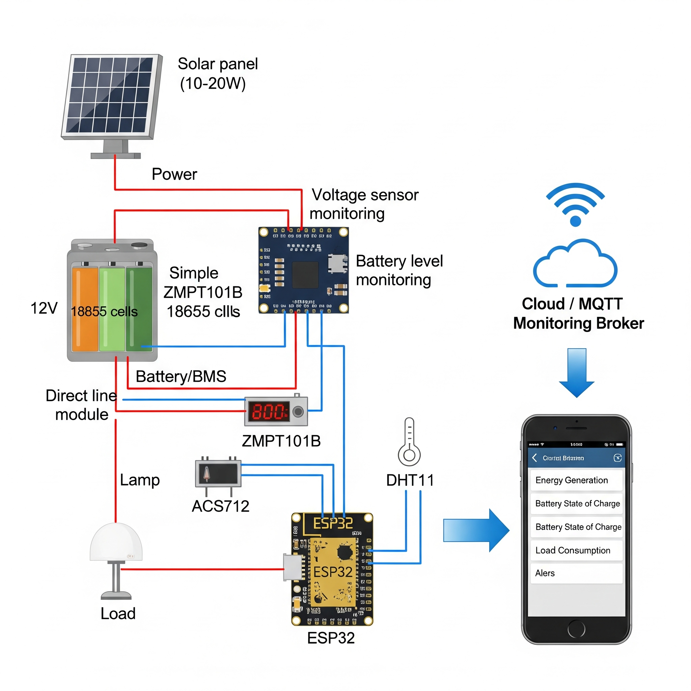

# SolarMonitor-ESP8266

Monitor solar-powered battery systems with **ESP8266**, **INA219**, and **Blynk**.  

## Features
- Measures voltage, current, and power.
- Low battery alert (buzzer + Blynk notification)
- Overcurrent alert (LED + Blynk notification)
- No sun detection alert (LED + Blynk notification)
- Rolling average to filter noise

## Wiring
- INA219 → I2C pins (SDA, SCL)
- BUZZER → D5
- LED → D6

## Setup
1. Clone repo
2. Install libraries: `Blynk`, `Adafruit INA219`
3. Configure `config.h` with Wi-Fi and Blynk credentials
4. Upload to ESP8266

## License
MIT License
